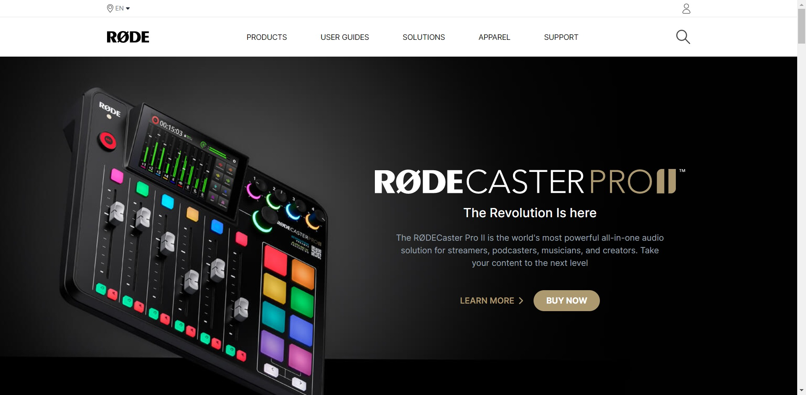

# Project 18 - HTML and Tailwind CSS

## Murtuza Rangwala

## What I learned from this Project?

- Learning Tailwind CSS and build the rode website Clone

- It Takes 12hours to complete this Project.

## Live Link of the Project:

[Live Project Link](https://mk-rode.netlify.app/)

## Output:

